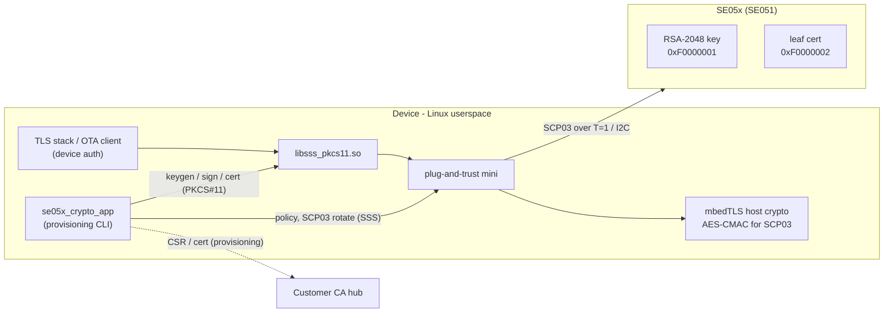
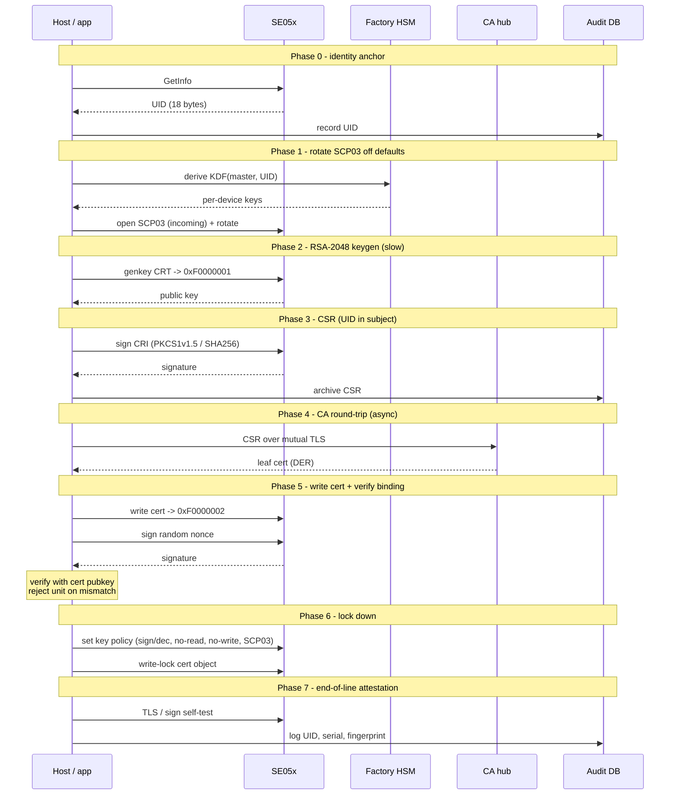

# SE05x Device Provisioning - RSA-2048 / PKCS#1 v1.5

Provision device identity into an SE051 at manufacturing: the RSA-2048 private
key is generated on-chip and never leaves it; the customer CA issues a leaf
certificate bound to the device.

**Setup:** SE051 (applet 7.2, `RSA_CRT`), mbedTLS host crypto, RSA-2048 with
`sha256WithRSAEncryption` (RSASSA-PKCS#1 v1.5), T=1 over I2C.

---

## 0. Architecture

Userspace Linux stack - no OP-TEE/TrustZone. The middleware + mbedTLS run in the
application; the SE holds the identity key and leaf cert. `libsss_pkcs11.so`
lets TLS stacks use the key by handle.

Both the provisioning CLI and the runtime TLS/OTA client go through
`libsss_pkcs11.so` for standard crypto (keygen, sign, cert read/write). PKCS#11
does not expose SE-specific management - object policies and SCP03 key
rotation - so the CLI keeps a direct SSS path for those.



---

## 1. What gets stored in the SE

Exactly two objects. The private key never leaves the chip.

| Object ID    | Type             | Contents                  | Policy after provisioning |
|--------------|------------------|---------------------------|---------------------------|
| `0xF0000001` | RSA-2048 keypair | device identity key       | sign/decrypt only, non-exportable, SCP03-required |
| `0xF0000002` | Binary file      | device leaf cert (DER)    | read allowed, write-locked |

---

## 2. Trust model

- **Root CA** - offline, in an HSM. Never on the line.
- **Issuing CA** - the "CA hub" that signs CSRs (itself HSM-backed).
- **Device leaf** - one per SE, subject/SAN bound to the SE UID.

The device only ever *presents* its leaf for outbound TLS auth; the server
verifies it. The device stores no chain.

---

## 3. Provisioning phases

| Phase | Step | Where |
|-------|------|-------|
| 0 | Read SE UID; record it as the device anchor | Host ↔ SE |
| 1 | Open SCP03; rotate keys off defaults to `KDF(master, UID)` | Host ↔ SE ↔ HSM |
| 2 | Generate RSA-2048 CRT keypair → `0xF0000001` **(slow)** | SE |
| 3 | Build CSR; SE signs the CRI; embed UID in subject | Host ↔ SE |
| 4 | Send CSR to CA hub over mutual TLS; receive leaf cert | Host ↔ CA |
| 5 | Write cert → `0xF0000002`; verify key↔cert binding | Host ↔ SE |
| 6 | Lock object policies | Host ↔ SE |
| 7 | End-of-line attestation (TLS/sign self-test); log | Host ↔ SE ↔ DB |

**Ordering:** phases 1–3 must run in one SCP03 session (rotated keys active).
Phase 4 is async; phase 5 re-opens a session by re-deriving the per-device key
from the UID - so write-back can happen at a different station.

---

## 4. Sequence



---

## 5. Manufacturing throughput

RSA-2048 on-SE keygen (phase 2) is the bottleneck - seconds to tens of seconds
per unit. Engineer around it:

- **Start keygen early** and overlap it with other assembly/flash steps.
- **Run fixtures in parallel** to hide per-unit latency at line level.
- **No premature timeouts** - host watchdog, SCP03 session, and I2C timeouts
  must all exceed worst-case keygen; the session stays open throughout.
- **Generate exactly once** - fixed key ID + "exists? reuse" so rework never
  re-burns the keygen time.

---

## 6. Security checklist (ship-blockers)

- [ ] Platform SCP03 rotated **off** the NXP/sample keys to per-device values
- [ ] RSA key **non-exportable**, sign/decrypt only, SCP03-required
- [ ] Cert object **write-locked** after provisioning
- [ ] **Key↔cert binding verified** at write-back (phase 5)
- [ ] SE **UID bound into the cert** (subject/SAN)
- [ ] CA hub endpoint **mutually authenticated**; root offline
- [ ] **Attestation self-test** passes (phase 7)
- [ ] Provisioning is **idempotent** (safe on rework)
- [ ] Per-unit **audit record** written (UID, serial, fingerprint)

---

## 7. CLI mapping

| Phase | Command | Status |
|-------|---------|--------|
| 0 | `se uid` | **done** |
| 2 | `rsa genkey --id 0xF0000001 --bits 2048 [--force]` | **done** - idempotent; reuses existing key unless `--force` |
| 3 | `rsa csr --id 0xF0000001 --subject "CN=...,serialNumber=<UID>"` | **done** - `sha256WithRSAEncryption` PKCS#1 v1.5 |
| 5 | `rsa write-cert --id 0xF0000002 --in leaf.der` | **done** - SSS-only; idempotent erase-then-write |
| 5 | `rsa verify-binding --id 0xF0000001 --cert leaf.der` | **done** - TRNG nonce → SE sign → mbedTLS verify |
| 6 | `set-policy --id 0xF0000001 --sign-only --no-read --no-write` | **not yet** |
| 1 | `rotate-scp03` (KDF from UID) | **not yet** - irreversible, handle carefully |

Standard crypto (genkey, sign, verify, encrypt, decrypt, csr, rng) is routed
through PKCS#11 when `--pkcs11 <lib>` is given.  Management commands
(`se uid`, `rsa write-cert`, `rsa verify-binding`) always use the direct SSS
path and do not accept `--pkcs11`.

Default key ID in the CLI is `0xFE000001` (demo/test range).  Explicitly pass
`--id 0xF0000001` / `--id 0xF0000002` for production objects.

Output goes to stdout by default; `--log <file>` redirects result output to a
file while status lines continue to stderr.

---

## 8. Open decisions

1. Device key **sign-only**, or also **decrypt/key-transport** for TLS?
   (Sets the decrypt policy bit on `0xF0000001`.)
2. SCP03 keys **per-device** (UID-KDF, recommended) or **per-batch**?
3. Is the RSA key **non-deletable** for the product's life?
4. Do you advance the applet out of pre-perso during provisioning?

---

# Platform reference

Background on the SE05x stack as used in this design. Unlike the Foundries.io /
OP-TEE integration (where SCP03 runs in TrustZone and keys derive from the
Hardware Unique Key), this design runs the middleware in **userspace Linux**:
the plug-and-trust mini package + mbedTLS host crypto, driven by
`se05x_crypto_app` and exposed to TLS stacks via `libsss_pkcs11.so`.

**Recommended reading**

- SE050 Data Sheet - part capabilities, object model, timings
- AN12413 - SE05x APDU specification
- UM11225 - T=1 over I2C specification
- AN12514 - SE05x user guidelines / security recommendations
- GlobalPlatform Card Spec 2.3.1 + SCP03 v1.1.2 - secure channel

## Secure channel (SCP03)

All host↔SE traffic is protected by GlobalPlatform SCP03: APDUs are
encrypted/MAC'd on the host and decrypted/verified on the SE. Session keys are
derived per connection from the static Platform SCP03 keys (ENC/MAC/DEK) plus
the card and host challenges.

In this build the static keys are read from a file
(`EX_SSS_BOOT_SCP03_PATH` → `plain_scp03.txt`) and all session-key derivation
(AES-CMAC) runs in mbedTLS on the host.

> **Note** - the mbedTLS host crypto must be built with `MBEDTLS_CMAC_C`
> (plus `MBEDTLS_AES_C`, `MBEDTLS_CIPHER_C`). Without CMAC, session-key
> derivation fails inside `nxScp03_Generate_SessionKey` and the channel never
> opens, even though I2C, ATR, and applet select all succeed.

> **Note** - rotate the static keys off the NXP/sample defaults before ship.
> Use per-device keys `KDF(master, UID)` with the master held only in the
> factory HSM, so any station can re-derive a unit's keys from its UID.

> **Warning** - there is no recovery protocol if the static keys are lost or
> rotated without being recorded. A unit whose SCP03 keys are unknown cannot be
> reached over the secure channel again. Record the master key securely; treat
> rotation as irreversible.

## SE05x non-volatile memory

Persistent secure objects in this design: the RSA-2048 identity key
(`0xF0000001`) and the leaf certificate (`0xF0000002`). They survive reset and
power cycles; transient objects (e.g. an ECDH peer key) do not.

> **Warning** - erasing/initializing the SE NVM deletes all keys and
> certificates. Any PKCS#11 handles pointing at them are left dangling. NVM
> reset does **not** change the SCP03 static keys.

## PKCS#11 integration

`libsss_pkcs11.so` exposes the SE objects as a PKCS#11 token so standard TLS
stacks (OpenSSL, the OTA client's device auth key, etc.) can use the device
key without ever seeing the private material.

> **Note** - the PKCS#11 "private key" is only a **handle** to the key in SE
> NVM; the private key is never exported. The leaf certificate (`0xF0000002`)
> is read out in DER and imported into the token alongside the handle.

This is how the on-chip identity key plugs into outbound mutual-TLS (e.g.
fetching updates) without copying the key to the filesystem.

## Tooling - `se05x_crypto_app`

The CLI used across the provisioning phases:

```
se05x_crypto_app [--pkcs11 <lib>] [--port <conn>] [--log <file>] <group> <command> [options]

  rng    <nbytes>
  se     uid
  rsa    genkey [--id <hex>=0xFE000001] [--bits 2048|3072|4096] [--force] [--pem]
  rsa    pub    [--id <hex>] [--out <file>] [--pem]
  rsa    sign   [--id <hex>] --in <file>  [--out <file>]
  rsa    verify [--id <hex>] --in <file>  --sig <file>
  rsa    encrypt/decrypt  [--id <hex>] --in <file> [--out <file>]
  rsa    csr    [--id <hex>] --subject "CN=..."

  Provisioning (SSS-only, no --pkcs11):
  rsa    write-cert      --id 0xF0000002  --in leaf.der
  rsa    verify-binding  --id 0xF0000001  --cert leaf.der

  Not yet implemented:
  rsa    set-policy      --id 0xF0000001 --sign-only --no-read --no-write
         rotate-scp03    (derive per-device keys from UID; irreversible)
```

`--pkcs11` routes standard crypto through `libsss_pkcs11.so` (PKCS#11 CKM_SHA256_RSA_PKCS
/ CKM_RSA_PKCS_OAEP); without it, the SSS + mbedTLS path is used directly.
Only one session is opened per invocation (SCP03 channel conflict prevention).

Connect string via `--port` or `EX_SSS_BOOT_SSS_PORT` (e.g. `/dev/i2c-3:0x48`).
`--log <file>` redirects result output to a file; status lines always go to stderr.