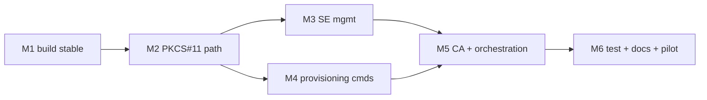

# Implementation Plan — SE05x RSA-2048 Provisioning System

Plan to take `se05x_crypto_app` from a working crypto CLI to a complete
manufacturing provisioning tool: PKCS#11-backed standard crypto, SE-specific
management (policy, SCP03 rotation), the provisioning subcommands, CA-hub
integration, test harness, and docs.

**Assumptions:** 1 engineer; SE051 hardware + the `demo_se051` reference
available; SCP03/CMAC bring-up already resolved; CA hub reachable or stubbed.
Estimates are engineer-days (eng-d) with a range; total includes buffer.

---

## 1. Scope

In scope:
- Route standard crypto (keygen, sign, cert read/write, CSR) through
  `libsss_pkcs11.so`; keep a direct SSS path for SE-specific operations.
- New subcommands: `write-cert`, `verify-binding`, `set-policy`, `rotate-scp03`,
  `uid`, plus an idempotency guard on `genkey`.
- A provisioning orchestration script chaining phases 0–7 with audit logging.
- CA-hub client (submit CSR, fetch cert) + a local stub CA for testing.
- Test harness (unit + on-hardware integration + end-to-end) and documentation.

Out of scope (flag for later): EdgeLock 2GO integration, multi-station line
orchestration software, production HSM integration (we model it with a KDF +
test master), field firmware.

---

## 2. Work breakdown & estimates

| ID | Workstream | Tasks | Est. (eng-d) |
|----|-----------|-------|--------------|
| WS1 | Build hygiene | `BUILD_ALWAYS ON`, pin mbedTLS config (`MBEDTLS_CMAC_C`), reproducible build, CI smoke build | 0.5–1 |
| WS2 | PKCS#11 crypto path | Cryptoki init/session/login; map `genkey`, `sign`, `verify`, `encrypt`, `decrypt`, cert read/write to `C_*`; reconcile with existing CSR ASN.1 assembly | 4–6 |
| WS3 | SE management (SSS) | `set-policy` (sign/dec-only, no-read, no-write, SCP03-required); `rotate-scp03` (KDF from UID) with dry-run + confirm guard | 4–6 |
| WS4 | Provisioning commands | `uid`; `write-cert`; `verify-binding` (nonce sign → verify w/ cert pubkey); `genkey` reuse guard (idempotent) | 2.5–3.5 |
| WS5 | CA-hub integration | CSR submit / cert fetch over mTLS; local stub CA (openssl) for tests | 2.5–3.5 |
| WS6 | Orchestration + audit | Script chaining phases 0–7; per-UID audit log (UID, serial, fingerprint, results); failure handling / resume | 2.5–3.5 |
| WS7 | Test harness | Unit tests; on-hardware integration suite; end-to-end provisioning test; negative/abuse cases | 3.5–4.5 |
| WS8 | Documentation | Operator runbook, command reference, troubleshooting, update the design doc | 2–3 |
| — | **Total** | | **24–35** |

Planning figure: **~28 eng-d (≈ 6 weeks)** including buffer and hardware time.

---

## 3. Milestones

| Milestone | Contents | Exit criteria |
|-----------|----------|---------------|
| M1 — Build stable | WS1 | Clean rebuild always picks up source changes; `rng 16` returns bytes on hardware |
| M2 — PKCS#11 path | WS2 | `genkey`/`sign`/`verify`/`encrypt`/`decrypt`/`csr` work via PKCS#11; CSR verifies in openssl |
| M3 — SE management | WS3 | `set-policy` enforced (read/write denied after lock); `rotate-scp03` round-trips on a test part |
| M4 — Provisioning cmds | WS4 | `write-cert` + `verify-binding` pass on a real issued cert; `genkey` idempotent |
| M5 — CA + orchestration | WS5, WS6 | One device provisioned end-to-end through the stub CA; audit record written |
| M6 — Test + docs | WS7, WS8 | Test suite green; runbook complete; pilot run of N units |

---

## 4. Test plan

### 4.1 Unit (host, no SE)
- CSR ASN.1 assembly: build a CSR with a known key, verify structure with
  `openssl req -text -noout`.
- Arg parsing, hex/file I/O, error paths.
- KDF for SCP03 derivation: known-answer test against a fixed master + UID.

### 4.2 On-hardware integration (per command)

| Command | Test | Pass criteria |
|---------|------|---------------|
| `rng 16` | request bytes | 16 hex bytes, non-constant across runs |
| `rsa genkey` | generate at `0xF0000001` | succeeds; public key returned; second run without `--force` is a no-op |
| `rsa sign`/`verify` | sign a file, verify | `VERIFY OK`; tampered input → `VERIFY FAILED` (exit 2) |
| `rsa encrypt`/`decrypt` | round-trip a payload | output == input |
| `rsa csr` | issue CSR | `openssl req -verify -text -noout` passes; UID present in subject |
| `set-policy` | lock key, then attempt read/export | read/export denied; sign still works |
| `verify-binding` | against matching + mismatched cert | match → pass; mismatch → reject |
| `rotate-scp03` | rotate on a sacrificial part, reconnect | new session opens with derived keys |

### 4.3 End-to-end provisioning
Run the orchestration script against the stub CA on a fresh test part:
1. read UID → 2. rotate SCP03 → 3. keygen → 4. CSR → 5. stub CA signs →
6. write-cert → 7. verify-binding → 8. set-policy → 9. attestation self-test →
10. audit record.
Pass: device ends with locked key + leaf cert, binding verified, TLS self-test
succeeds, audit row complete.

### 4.4 Negative / robustness
- Power-cut mid-keygen → re-run is idempotent (no duplicate/garbage object).
- Wrong/mismatched cert at write-back → `verify-binding` rejects.
- Re-provision an already-locked part → clean, well-defined failure.
- CA unreachable → CSR archived, resumable at write-back station.

### 4.5 Manufacturing dry-run
Provision a small pilot batch (e.g. 10–20 units) end-to-end; measure per-unit
keygen time and total takt; confirm audit log integrity and per-UID uniqueness.

---

## 5. Documentation deliverables

| Doc | Audience | Contents |
|-----|----------|----------|
| Design doc (exists) | Eng | Architecture, object map, phases, sequence, security |
| Operator runbook | Line/test ops | Step-by-step per station, expected output, what "good" looks like |
| Command reference | Eng/integrators | Every subcommand: args, examples, exit codes |
| Troubleshooting | Line/support | SCP03 failures, I2C errors, CMAC/build gotchas, keygen timeouts |
| Audit/format spec | Eng/QA | Audit record schema, where logged, retention |
| Security notes | Security/QA | SCP03 key custody, policy settings, recovery (none) caveats |

---

## 6. Risks & mitigations

| Risk | Impact | Mitigation |
|------|--------|-----------|
| `rotate-scp03` mis-set → part locked out (no recovery) | High | Dry-run + explicit confirm; test only on sacrificial parts first; record master in HSM |
| PKCS#11 build lacks needed mechanisms (RSA PKCS#1 v1.5, cert objects) | Med | Verify mechanism list on `libsss_pkcs11.so` at M2 start; fall back to SSS for unsupported ops |
| RSA-2048 keygen time blows line takt | Med | Measure early; parallel fixtures; pre-generate; budget worst case |
| Applet policy forbids an op in plain/SCP03 session | Med | Confirm against `AppletConfig`; test each op on hardware at M2/M3 |
| CA-hub API differs from stub | Low | Keep CA client behind a small interface; swap stub for real endpoint at M5 |

---

## 7. Acceptance criteria

- All §4.2 commands pass on hardware; CSR verifies in openssl.
- End-to-end provisioning (§4.3) produces a locked key + bound leaf cert and a
  complete audit record.
- `verify-binding` rejects a mismatched cert; `set-policy` lock is enforced.
- Pilot batch (§4.5) provisions with per-UID uniqueness and measured takt.
- Runbook + command reference + troubleshooting docs complete.

---

## 8. Suggested sequencing

WS3 (SE management) and WS4 (provisioning commands) can run in parallel after
M2, since they touch different code paths (SSS management vs PKCS#11 crypto +
binding check).